# Indoor Localization Simulator — Step-by-Step Tutorial

This tutorial explains a complete end-to-end workflow:

1. Create a planimetry
2. Add beacons
3. Define a trajectory
4. Generate RSS or ToF signals
5. Run localization algorithms
6. Compare errors
7. Save and reload the project

---

## 0. Before starting

Install dependencies:

```bash
uv sync
```

Run the application:

```bash
uv run indoor-loc-sim
```

When the application opens, you will see five tabs:

1. **Planimetry**
2. **Trajectories**
3. **Signals**
4. **Estimation**
5. **Error Analysis**

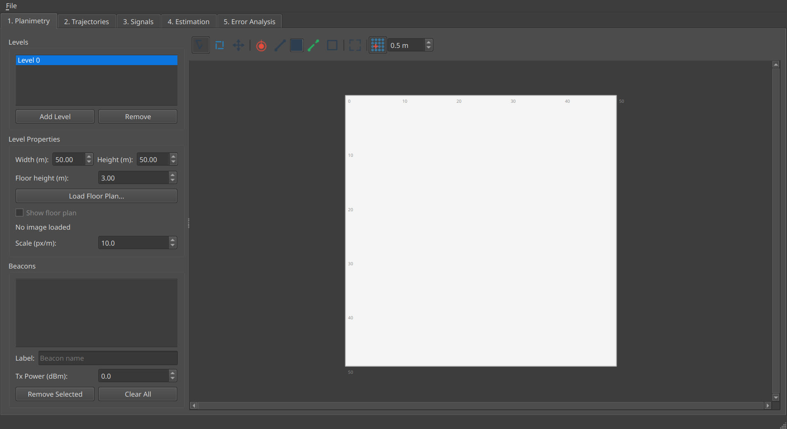

---

## 1. Create the planimetry

Go to the **Planimetry** tab.

In this tab you can:

- create one or more levels
- set the level dimensions in meters
- load a floor plan image
- calibrate image scale
- draw walls and doors
- add beacons

The main window title shows the current open file name. If the building has unsaved changes, a `*` appears before the file name.

### 1.1 Create or select a level

Use the **Levels** box on the left:

- click **Add Level** if needed
- select the active level in the list

Then define:

- **Width (m)**
- **Height (m)**
- **Floor height (m)**

If you do not have a background image, the application uses a metric grid.

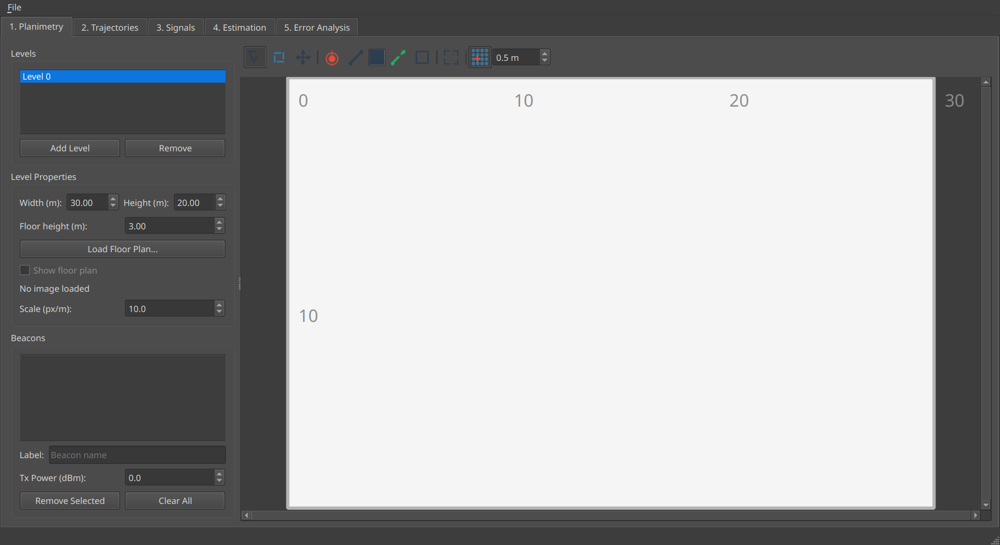

### 1.2 Load a floor plan image (optional)

Click **Load Floor Plan...** and choose a PNG image.

Then adjust:

- **Scale (px/m)**
- **Width / Height (m)**

Use the checkbox **Show floor plan** to toggle visibility of the image while keeping all geometry. When the image is hidden, the canvas shows a white metric background/grid instead of an empty scene.

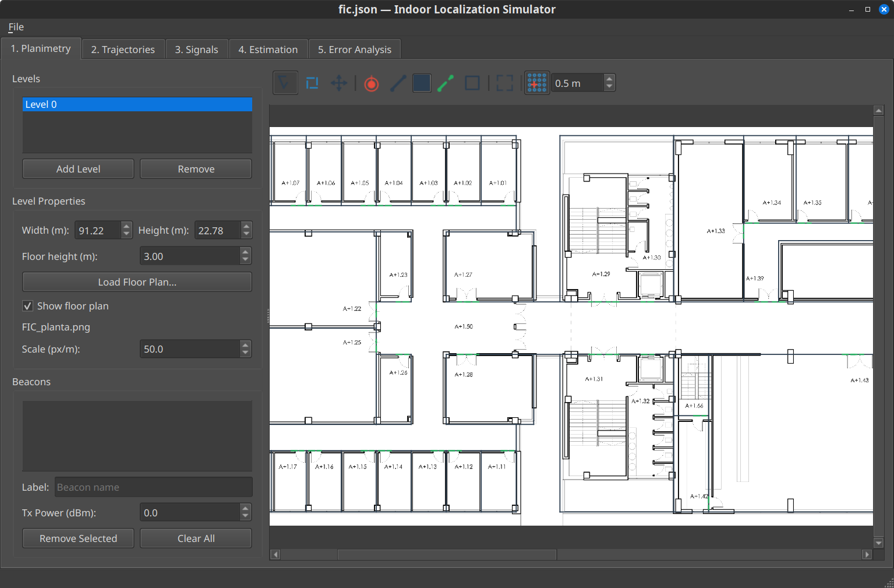

### 1.3 Draw walls and doors

Use the toolbar above the canvas:

- **Select**
- **Rectangle select**
- **Pan**
- **Beacon**
- **Wall**
- **Door**
- **Room**
- **Fit view**
- **Snap**

Navigation notes:

- the **Pan** tool provides persistent panning
- you can also pan temporarily by dragging with the **middle mouse button**

To draw walls and doors:

1. select the **Wall** or **Door** tool
2. click the start point
3. click the end point

Selection and deletion notes:

- in **Select** mode you can click walls, doors, and beacons directly
- doors placed on walls can be selected independently of the wall underneath
- selected elements can be deleted with **Delete** or **Backspace**

To draw a simple rectangular room:

1. select the **Room** tool
2. drag a rectangle on the canvas

Useful options:

- **Snap** to align geometry to a grid
- **Snap spacing** to control the step
- **Wall color** to improve visibility

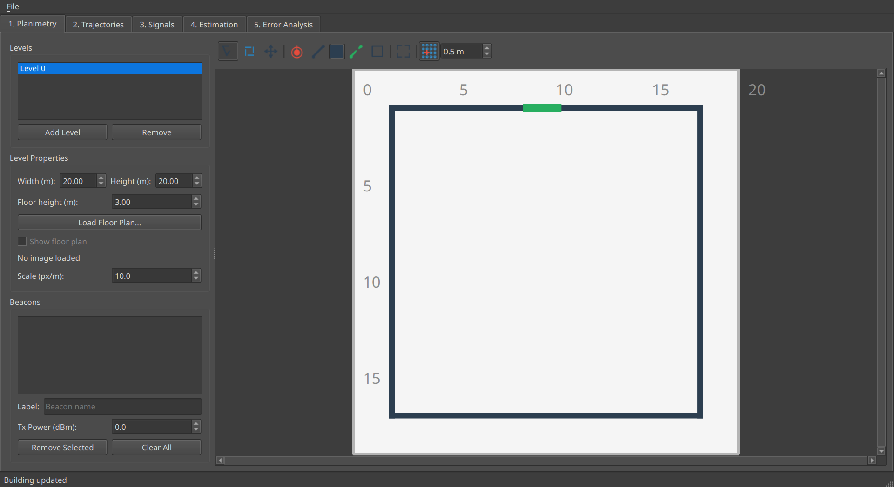

---

## 2. Add and edit beacons

### 2.1 Place beacons

Select the **Beacon** tool in the planimetry toolbar and click on the canvas to place beacons.

Each beacon appears:

- on the canvas
- in the beacon list on the left

### 2.2 Edit beacon properties

For each beacon you can edit:

- **Label**
- **Tx Power (dBm)**

You can also:

- move beacons directly by dragging them on the map
- remove the selected beacon
- clear all beacons

Any beacon movement in planimetry is propagated to the other tabs.

### Practical recommendation

For a first test, place 4 beacons near the corners of the floor.

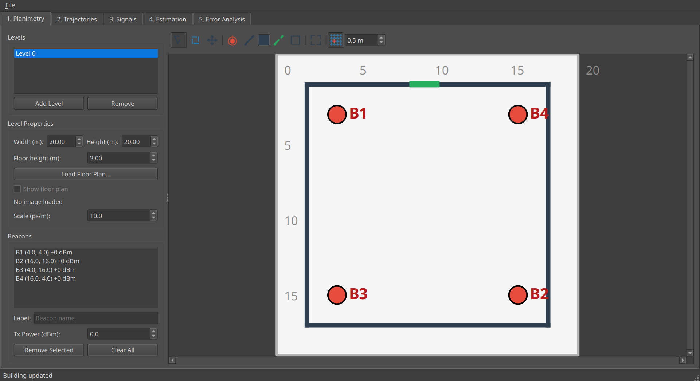

---

## 3. Create a trajectory

Go to the **Trajectories** tab.

This tab is used to define the motion of the simulated user.

### Parameters

- **Walking speed (m/s)**
- **Sampling frequency (Hz)**

These two values define the final time-discretized trajectory.

### 3.1 Add waypoints

Click **Draw Trajectory Mode** and then click on the map to add waypoints.

The waypoint list on the left updates automatically.

### 3.2 Generate the trajectory

Click **Generate!**

The application creates a ground-truth trajectory with:

- interpolated spatial path
- assigned timestamps
- estimated velocities
- final resampling at the selected frequency

The generated trajectory is drawn on:

- the trajectory tab canvas
- the shared planimetry canvas overlay

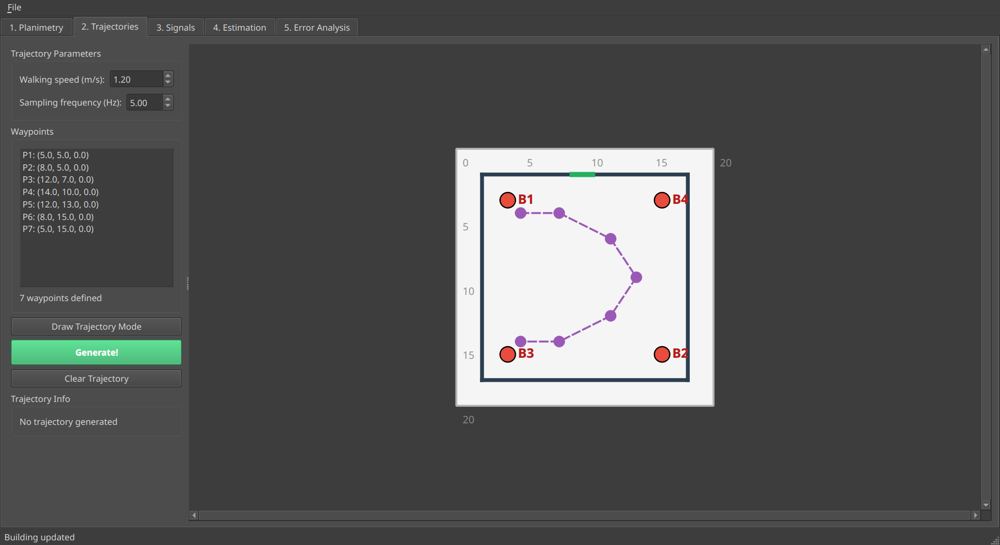

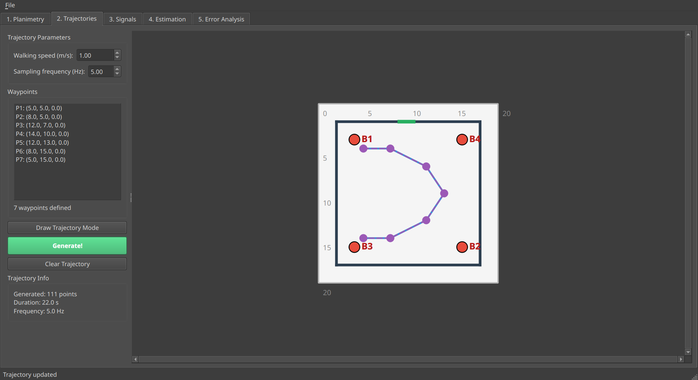

---

## 4. Generate signals

Go to the **Signals** tab.

This tab generates measurements for all beacons along the ground-truth trajectory.

### Available signal types

- **RSS**
- **ToF**

### Parameters

#### Signal configuration

- **Signal type**
- **Samples per point**

#### Noise parameters

- **RSS σ**
- **ToF σ (ns)**

#### Propagation model

- **A (RSSI at d₀)**
- **d₀ (ref. distance)**
- **Wall attenuation (dB)**
- **NLoS mode (ToF)**
- **NLoS error multiplier**
- **Path loss exponent**

### 4.1 Generate RSS measurements

For a first example:

- choose **RSS**
- set **Samples per point = 1** or more
- choose a reasonable **RSS σ**
- click **Generate Signals**

The plot on the right shows the signal evolution over time for each beacon.


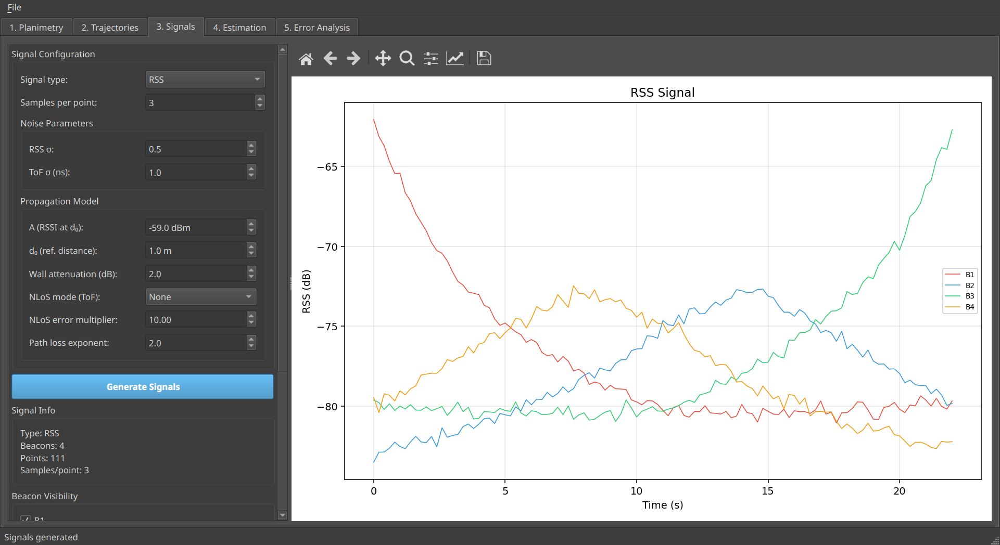

### 4.2 Generate ToF measurements

To simulate ToF instead:

- choose **ToF**
- set **ToF σ (ns)**
- optionally configure NLoS handling
- click **Generate Signals**

This creates time-of-flight measurements in seconds internally.

### 4.3 Show an RSS heatmap

Still in the Signals tab, you can visualize RSS coverage:

1. choose a specific beacon or **All (average)**
2. choose **Resolution (m)**
3. click **Show Heatmap**

The right panel switches from the time plot to a heatmap view.

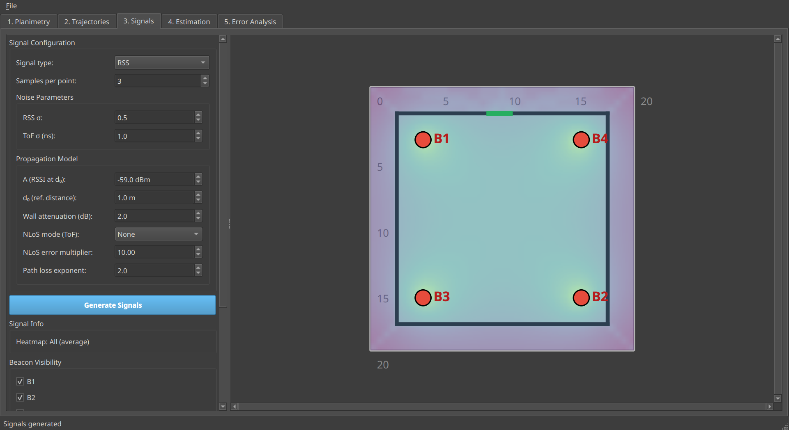

---

## 5. Run localization algorithms

Go to the **Estimation** tab.

This tab runs localization algorithms on the generated signals.

### Available algorithms

- **EKF + RSS**
- **EKF + ToF**
- **EKF + RSS + Accel**
- **UKF + RSS**
- **Trilateration + ToF**
- **Trilateration + RSS**
- **Fingerprint + RSS**

The parameter panel is dynamic: controls that do not affect the selected algorithm are disabled automatically.

### 5.1 EKF + RSS

Select **EKF + RSS**.

Relevant parameters:

- **Process noise σ**
- **Measurement noise σ (dB)**

Then click **Run Estimation**.

The result is:

- added to the simulation history
- drawn on the map
- stored for later error analysis

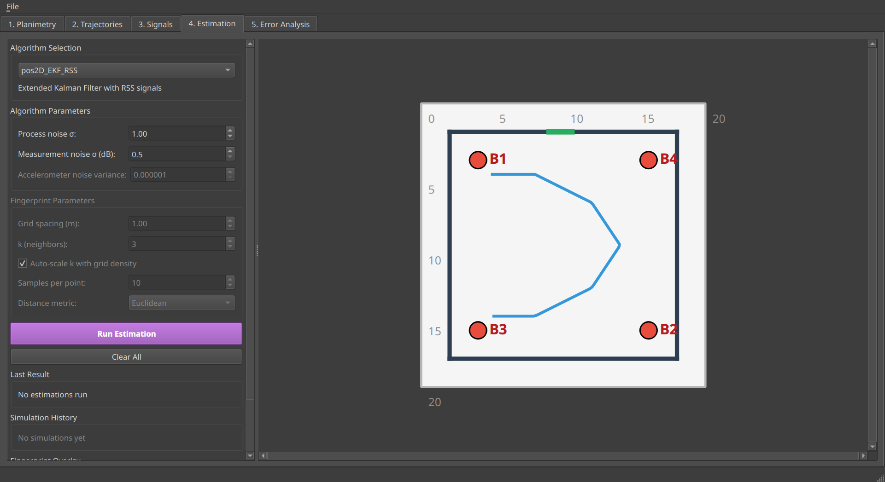

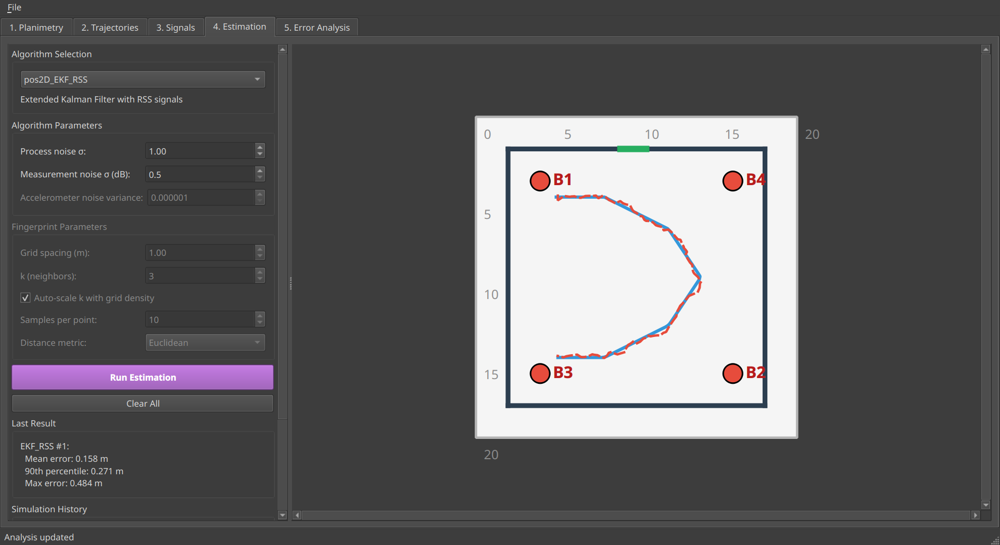

### 5.2 EKF + ToF

Select **EKF + ToF**.

Relevant parameters:

- **Process noise σ**
- **Measurement noise σ (ns)**

This algorithm uses ToF-derived ranges internally and estimates position in 2D with known `z`.

### 5.3 EKF + RSS + Accel

Select **EKF + RSS + Accel**.

Relevant parameters:

- **Process noise σ**
- **Measurement noise σ (dB)**
- **Accelerometer noise variance**

This algorithm simulates accelerometer measurements from the ground-truth trajectory and fuses them with RSS.

It is especially useful to test behavior on turning trajectories.

### 5.4 Trilateration + ToF

Select **Trilateration + ToF**.

No filter parameters are required.

Requirements:

- ToF signal must be active
- at least 3 valid beacons per estimation step

If fewer than 3 valid ranges are available at a given step, the algorithm keeps the previous estimate.

### 5.5 Trilateration + RSS

Select **Trilateration + RSS**.

This algorithm now:

- always picks the **3 strongest RSS beacons** at each step
- converts RSS to distance using the signal-generation path-loss parameters
- reuses the previous estimate if there are fewer than 3 valid measurements

This method is often much less stable than the Kalman-filter-based methods.

### 5.6 Fingerprint + RSS

Select **Fingerprint + RSS**.

Relevant parameters:

- **Grid spacing (m)**
- **k (neighbors)**
- **Auto-scale k with grid density**
- **Samples per point**
- **Distance metric**

When you run it, the application first builds a radio map and then estimates each trajectory point using weighted k-NN.


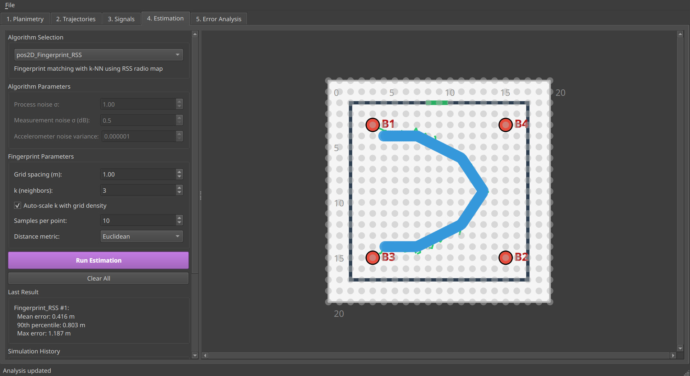

---

## 6. Compare localization errors

Go to the **Error Analysis** tab.

This tab compares all stored simulation runs.

### Available plots

- **CDF of Errors**
- **Error over Time**
- **X Error over Time**
- **Y Error over Time**

### Workflow

1. choose the plot type
2. enable or disable the runs you want to compare
3. inspect the **Summary** table
4. optionally export to CSV

The summary includes:

- Mean
- P50
- P90
- Max

All values are in meters.

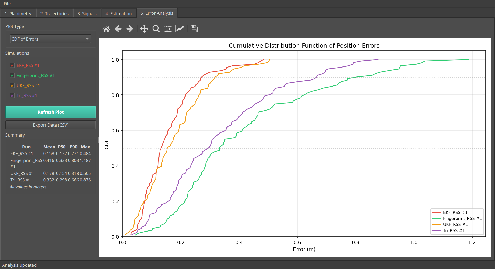

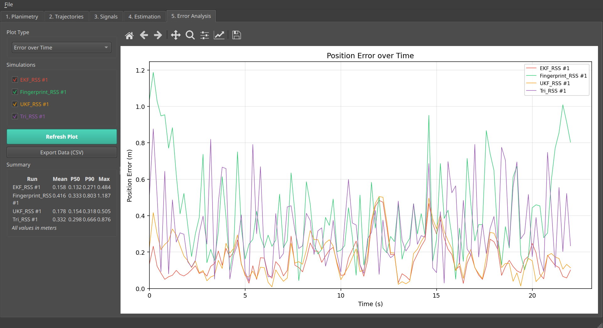

---

## 7. Save and reload a project

Use the **File** menu:

- **Save Building**
- **Save Building As...**
- **Save Project**
- **Save Project As...**
- **Open Project...**

Standard save behavior:

- if you opened a building JSON, **Save Building** overwrites that same file
- if you opened a project file, **Save Project** overwrites that same project
- **Save ... As** creates a new file at a different path
- if the building has unsaved changes and you close the window, the app offers **Save**, **Cancel**, or **Exit without saving**

The current `.ilsim` project format stores:

- building
- waypoints
- ground-truth trajectory
- generated signals
- previous simulation runs
- floor plan images

This means you can close the application and later continue working with the same project state.

---

## 8. Suggested first experiment

If you want a simple reproducible demo:

1. Create a **30 × 20 m** level
2. Place **4 beacons** near the corners
3. Draw a curved trajectory with several waypoints
4. Generate **RSS** with low noise
5. Run:
   - EKF + RSS
   - UKF + RSS
   - Trilateration + RSS
   - Fingerprint + RSS
6. Compare all runs in **Error Analysis**

Then repeat with:

- higher RSS noise
- different path-loss exponent
- more walls

This gives a good feel for how sensitive each method is.

---

## 9. Common pitfalls

### Signals do not match the selected algorithm

Example:

- you generated RSS signals
- but selected **Trilateration + ToF**

In that case the app will refuse to run and show a warning in the result panel.

### RSS trilateration is unstable

This is expected.

Reasons:

- RSS is converted into distance indirectly
- the model is sensitive to noise and calibration mismatch
- walls and path-loss mismatch can produce large errors

### Planimetry edited after simulation

If you move beacons or change walls after generating signals or running estimation, previous signals/results may no longer be physically consistent with the new layout.

---
